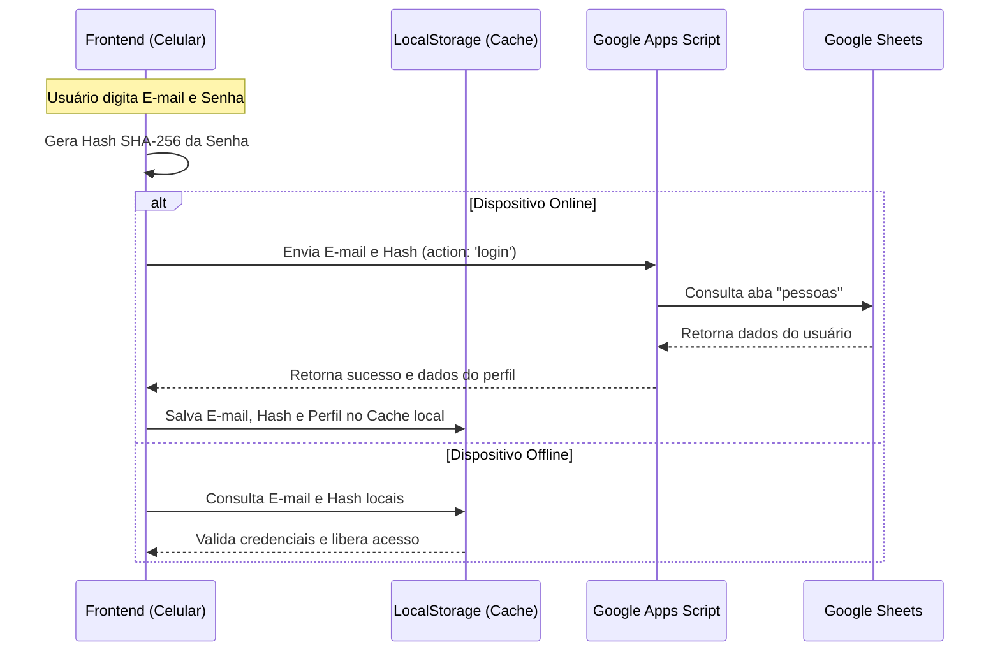

# Plano de Implementação - Autenticação por Planilha (Sem Firebase)

Este plano descreve como implementar o sistema de controle de login seguro baseado em E-mail e Senha diretamente na Planilha Google (usando Google Apps Script) e no armazenamento local (localStorage) para permitir o login offline. Essa abordagem dispensa o uso do Firebase, mantendo o aplicativo 100% gratuito e independente.

---

## Detalhes da Arquitetura de Login

---

## Proposed Changes

### Componente: Google Apps Script

#### [MODIFY] [google-apps-script.js](file:///g:/Meu%20Drive/spirit/ssvp/web-app/desenvolvimento/google-apps-script.js)
*   **Atualização do Esquema (`SCHEMAS.pessoas`)**:
    *   Adicionar as colunas `email` e `senha` ao final do array.
*   **Banco Inicial (`initializeDefaultData`)**:
    *   Popular os 4 vicentinos padrão com seus respectivos e-mails e hashes SHA-256 da senha padrão `123`:
        *   Hash de `123`: `a665a45920422f9d417e4867efdc4fb8a04a1f3fff1fa07e998e86f7f7a27ae3`
        *   José: `jose@ssvp.org`
        *   Maria: `maria@ssvp.org`
        *   Pedro: `pedro@ssvp.org`
        *   Marta: `marta@ssvp.org`
    *   Os assistidos (João, Raquel, André, Débora) terão estes campos vazios `""`.
*   **Função `doPost(e)`**:
    *   Detectar requisições do tipo `{ action: 'login', email: '...', passwordHash: '...' }`.
    *   Buscar o usuário pelo e-mail e conferir o hash da senha.
    *   Se correto, retornar `{ success: true, user: { id, nome, cargo, sexo, email, passwordHash } }`.
*   **Atualização de Versão (`checkAndInitializeCopy`)**:
    *   Incrementar a versão do banco para `'v0.3.7'` para forçar a migração automática na planilha do usuário (adicionando as novas colunas e credenciais).

---

### Componente: Frontend

#### [MODIFY] [index.html](file:///g:/Meu%20Drive/spirit/ssvp/web-app/index.html)
*   **Remover Seletor de Sessão**: Excluir o dropdown `<select id="session-user-select">` do cabeçalho.
*   **Adicionar Tela de Login**:
    *   Criar uma seção ou modal de login (`#login-screen`) que cubra o app se o usuário não estiver autenticado.
    *   O formulário de login conterá: URL da Planilha (se não auto-detectada), E-mail e Senha.
*   **Adicionar Perfil do Usuário e Logout no Header**:
    *   Exibir o nome e o cargo do vicentino logado no cabeçalho (ex: `Olá, José (Presidente)`).
    *   Adicionar um botão simples de "Sair" (Logout).

#### [MODIFY] [src/main.js](file:///g:/Meu%20Drive/spirit/ssvp/web-app/src/main.js)
*   **Função de Criptografia**:
    *   Implementar `hashPassword(password)` usando a API nativa do navegador (`crypto.subtle.digest('SHA-256')`) para transformar a senha em hash hexadecimal antes de enviar ou salvar.
*   **Lógica de Login & Sessão**:
    *   Armazenar em `localStorage` as credenciais logadas (`ssvp_session_user` e `ssvp_session_hash`).
    *   No carregamento do app (`loadData`):
        *   Verificar se hay sessão ativa salva. Se não houver, exibe a tela de login.
        *   Se houver, valida offline e mantém o acesso liberado.
*   **Validação Online e Sincronismo**:
    *   Ao fazer login online, enviar requisição POST com `{ action: 'login' }` para o script da planilha.
    *   Em caso de sucesso, salvar os dados e sincronizar o banco local.
*   **Validação de Alterações**:
    *   Remover a migração legada `ssvp_v036_confrades_synced` e atualizar para a flag `ssvp_v037_login_migrated` para reiniciar o armazenamento local com as novas colunas de e-mail e senha.

---

## Verification Plan

### Manual Verification
1.  **Migração Automática do Banco**:
    *   Executar o script do Apps Script. Verificar se a aba `pessoas` recebeu as colunas `email` e `senha` preenchidas com os dados padrão.
2.  **Tela de Login (Online)**:
    *   Com internet ativa, preencher e-mail (`jose@ssvp.org`) e senha (`123`).
    *   Verificar se o login é bem-sucedido e os dados de pessoas e metas são carregados.
    *   Confirmar que o cabeçalho agora exibe: "👤 Trabalhando como: José Silva (Presidente)" e o botão "Sair" está visível.
3.  **Verificação de Hash na Planilha**:
    *   Conferir se a senha armazenada na planilha foi salva como hash e não como texto aberto.
4.  **Login Offline**:
    *   Desconectar da internet, fechar e reabrir o aplicativo.
    *   Verificar se o login permanece ativo e, caso clique em "Sair", se é possível logar novamente usando as credenciais cacheadas localmente.
5.  **Tentativa de Acesso com Senha Errada**:
    *   Tentar logar com senha inválida e verificar a mensagem de erro apropriada.
